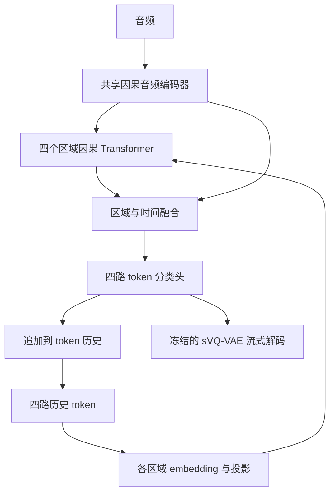

可以，**先只讨论结构：保留你已经训练好的 sVQ-VAE，把上面的音频到 token 模型改成“分区域建模，再统一融合”。** rollout 和抗退化训练先放下。

我建议这次采用一个明确的简化版本：**四个轻量区域分支 + 一个共享融合模块，端到端训练预测器，VQ 全部冻结。** 这是参考 LiveGesture 的改造方案，不是完整复现。

**1. 新模型整体怎么走**



参考 LiveGesture 的核心是：**区域专家先学习各部位的时间规律，融合模块再协调不同部位；两个层级都接收音频。**([m-usamasaleem.github.io][1])

你现有的音频编码器和 sVQ-VAE 都有复用价值，主要替换 `CausalEmageAudioTokenModel` 中间的动作预测部分。

**2. 第一处：去掉连续动作历史编码，直接输入四路 token**

删掉作为预测条件的：

```python
self.motion_encoder
self.bodyhints_face
self.bodyhints_body
```

新的输入变成：

```python
past_tokens = {
    "face":  ...,  # [B, N]
    "upper": ...,
    "hands": ...,
    "lower": ...,
}
```

每个区域单独转换为特征：

```python
h_r = token_embedding_r(past_tokens[r])  # [B, N, D]
```

这里有两种实现：

| 方法                          | 特点                    |
| --------------------------- | --------------------- |
| VQ codebook embedding → MLP | 更接近论文，保留已有 code 向量的信息 |
| 独立 `nn.Embedding(K_r, D)`   | 接口更简单，与 VQ 内部实现解耦     |

**你的第一版可以采用独立 embedding。** 不需要把现有 VQ 的 codebook 改成论文的维度或大小。每路分类头输出维度与该路实际 codebook 大小一致即可。

推理时，预测 token 直接进入历史；解码得到的 `330D` 动作只用于输出。

**3. 第二处：共享主干换成四个轻量区域分支**

你当前是：

> 完整动作共同编码 → 共享 Transformer → 拆成 upper/hands/lower。

改成：

> 四路 token 分别编码 → 各自做时间建模 → 再融合。

每个区域分支可以先用 **2 个 block**，每个 block 简化为：

```python
h = h + causal_self_attention(norm1(h))
h = h + causal_audio_cross_attention(norm2(h), audio_features)
h = h + ffn(norm3(h))
```

其中：

* self-attention 只读取允许访问的历史动作 token。
* cross-attention 只读取预测时刻已收到的音频。
* 四个区域使用独立参数，但共享同一份音频特征。
* 位置编码建议换成 RoPE，取代当前周期重复的位置编码。

这里的“每个 block 各一层注意力”是我建议的轻量化实现，不是论文逐层配置。

这样做的意义是：手部、下身、上身和面部先各自学习运动规律，不必一开始就挤进一个共同的动作表示。

**4. 第三处：用显式区域融合替换“其他分支特征相加”**

四个分支输出后堆叠：

```python
# 每个 h_r：[B, N, D]
h = torch.stack(
    [h_face, h_upper, h_hands, h_lower],
    dim=2,
)  # [B, N, 4, D]
```

建议先用 **1～2 个融合 block**，每个包含：

| 操作                 | 作用            |
| ------------------ | ------------- |
| 同时刻区域 attention    | 协调面部、上身、手和下身  |
| 因果时间 attention     | 整合融合后的历史信息    |
| 音频 cross-attention | 在融合阶段再次引入语音条件 |
| FFN                | 更新各区域表示       |

同一时刻的四个区域特征可以相互访问，前提是它们都由**历史动作 token 和允许读取的音频**得到，不包含当前目标动作的 GT token。

输出再分别进入四个分类头：

```python
logits = {
    part: output_heads[part](h[:, :, region_id])
    for region_id, part in enumerate(parts)
}
```

这就可以替换你现在的：

```python
body_motion_decoder_upper
body_motion_decoder_hands
body_motion_decoder_lower
```

原来独立的面部 decoder 也统一到第四个区域分支中。

**5. 训练先保持简单：冻结 VQ，联合训练整个预测器**

这次不引入专家预训练、冻结专家、单独训练融合等复杂阶段。

训练流程是：

1. 用冻结的四路 VQ 得到 GT token。
2. 对每路 token 右移，构造历史输入。
3. 四个分支和融合模块联合预测目标 token。
4. 用四路加权交叉熵训练。

```python
inputs[r] = prepend_bos(targets[r][:, :-1])
logits = model(audio, inputs)

loss = sum(
    weights[r] * cross_entropy(logits[r], targets[r])
    for r in parts
)
```

**右移 token 并不意味着自动改变音频时间对齐。** 可以先保留你当前“用上一块结束前的音频预测下一块”的定义，只改结构；这样后续对比时不会把结构收益与时间条件变化混在一起。

**6. 对现有代码的改动范围**

| 现有部分                                | 建议                               |
| ----------------------------------- | -------------------------------- |
| 四路 `StreamableVQVAE`                | 保留权重并冻结                          |
| `StreamableVQModel.decode_stream()` | 保留                               |
| 两套 `CausalMelAudioEncoder`          | 合并为一套共享编码器，暂时保留内部实现              |
| `CausalMotionTokenEncoder`          | 替换为四路 token embedding            |
| 共享动作 Transformer                    | 替换为四个轻量区域分支                      |
| 三个身体 cross-decoder、独立面部 decoder     | 替换为统一的区域与时间融合模块                  |
| 四路分类输出接口                            | 保留                               |
| 推理历史                                | 从 `past_motion` 改为 `past_tokens` |
| 训练损失                                | 第一版仍用四路分类损失                      |

**这版最值得借鉴的不是 LiveGesture 的全部层数和训练技巧，而是“先分区域学习，再显式融合”的组织方式。** 你已有的 sVQ-VAE 可以直接接上；需要重新训练的是上面的 token 预测器。

[1]: https://m-usamasaleem.github.io/publication/LiveGesture/LiveGesture.html?utm_source=chatgpt.com "LiveGesture"

修改：

**2. 需要修改：窗口滑动后不应继续强行保留 BOS**

位置：`modeling_emage_audio(6).py` 第 827～831 行。

现在是：

```python
past_tokens[part] = torch.cat(
    (past_tokens[part][:, :1], past_tokens[part][:, -history_window:]),
    dim=1,
)
```

这会永久保留 BOS，但后面的音频和位置编码已经滑动。

例如把窗口缩小成 3，当前代码会得到：

| 预测位置  | 音频位置    | 动作输入             |
| ----- | ------- | ---------------- |
| 预测 B4 | 0、1、2、3 | BOS、q1、q2、q3     |
| 预测 B5 | 1、2、3、4 | **BOS**、q2、q3、q4 |

第二行原本对应历史输入的位置 1 被替换成了 BOS。**真实 token 的对应关系没有全部错位，但 BOS 被当成不断移动的起点，并参与后续计算。** 这不是我们约定的连续历史窗口。

建议明确 `history_window_tokens` 表示“最多保留多少个输入位置”，直接裁剪：

```python
history_window = int(
    getattr(self.cfg, "history_window_tokens", 32)
)
if history_window < 1:
    raise ValueError("history_window_tokens must be positive")

# 每一步追加预测 token 后
past_tokens[part] = past_tokens[part][:, -history_window:]
```

BOS 会自然离开窗口。你现有的：

```python
audio_token_start = audio_token_end - history_tokens
```

可以继续使用。

**当前没有 KV cache，Q/K 又同时使用窗口内位置，RoPE 每次从 0 开始本身不是错误。** 不需要为了这个问题马上引入全局位置或缓存。

**3. 训练和推理的预测偏移是一致的，但保存结果仍少开头 4 帧**

训练现在是：

```python
target = VQ(motion_gt[:, 4:])
input  = [BOS, target[:-1]]
```

结合音频条件，对应：

| 预测目标 | 动作输入末项 | 最晚音频块 |
| ---- | ------ | ----- |
| B1   | BOS    | A0    |
| B2   | q1     | A1    |
| B3   | q2     | A2    |

推理也从 BOS 开始预测 B1。因此，**这里没有意外多右移一次；符合之前保留“预测下一块”的约定。**

但 `inference_fn()` 仍将 B1 当作视频第 0 帧保存，导致动作相对音频提前约 **133 ms**。

目前最直接的处理是：**评估和渲染预测区间时，将 GT 与音频也从第 4 帧对应时间开始。** 如果要保存完整时间线，则需要另外定义 B0 的初始化动作并补齐对应表情和平移。

另外这句注释不正确：

```python
# every target token is the first token of its VQ stream
```

一次编码整个 `future_motion`，只有第一个目标 token 是该流的第一个 token，建议改掉，避免后续误解。

**4. 训练窗口设置需要和推理配套**

当前 `forward()` 使用完整的因果历史，只有 `inference()` 裁剪窗口。

需要核对实际训练长度：

* 训练长度超过窗口时，训练会读取比推理更多的历史。
* 训练长度短于窗口时，推理会遇到训练中没有出现过的长历史。
* 训练始终从 BOS 开始，也没有覆盖窗口滑动后不含 BOS 的情况。

这里不需要引入 rollout。**使用 GT token 的随机历史子窗口训练就可以覆盖这些情况。**

注意：从完整右移序列中截取中间窗口时，保留该位置真实的前驱 token，**不要给每个中间窗口重新补 BOS**。音频也按相同的预测位置截取。

**5. 外部接口还要同步两处**

第一，训练脚本新增了：

```python
from models.emage_audio import shift_tokens_with_bos
```

但这次没有提供该包的 `__init__.py`。如果它没有导出这个函数，会报 `ImportError`。需要补导出，或直接从定义它的模块导入。

第二，上次的 `test_emage_audio.py` 仍调用：

```python
model.inference(
    audio, speaker_id, motion_vq, seed_motion=seed_motion
)
```

现在应改成：

```python
model.inference(audio, speaker_id)
```

旧的 seed 参数及其相关流程也应同步移除。训练脚本内的调用已经改对。

**6. 建议补上几个基本检查**

模型初始化时：

```python
if dim % nhead != 0:
    raise ValueError("hidden_size must be divisible by num_heads")
if (dim // nhead) % 2 != 0:
    raise ValueError("RoPE requires an even head dimension")
```

推理帧数计算改为：

```python
frames = audio.shape[1] * self.cfg.pose_fps // self.cfg.audio_sr
frames -= frames % block
total_blocks = frames // block

if total_blocks < 2:
    raise ValueError("Audio must contain at least two motion blocks")
```

避免 `audio_sr // pose_fps` 提前整除导致长度误差，以及短音频触发 `torch.cat([])`。

另外，当前四路共用一个 `vae_codebook_size`，**只有四个 VQ 的 codebook 大小都相同时才成立**，训练前应检查。

**我的结论是：架构可以保留，不需要再重写。优先修 BOS 裁剪、训练窗口和输出对齐，再同步测试接口，就可以开始训练这版预测器。** 区域 embedding、额外适配器等属于后续可选改进，不是当前必须补齐的部分；旧预测器 checkpoint 也不能直接作为这版完整权重加载。
